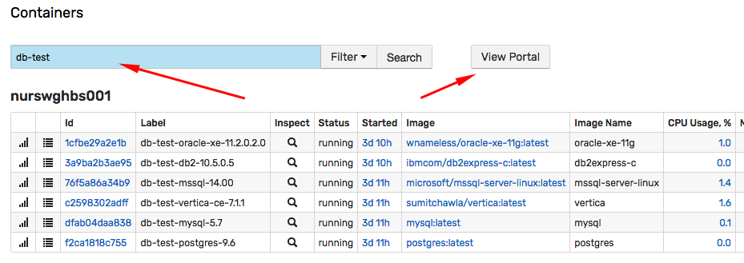
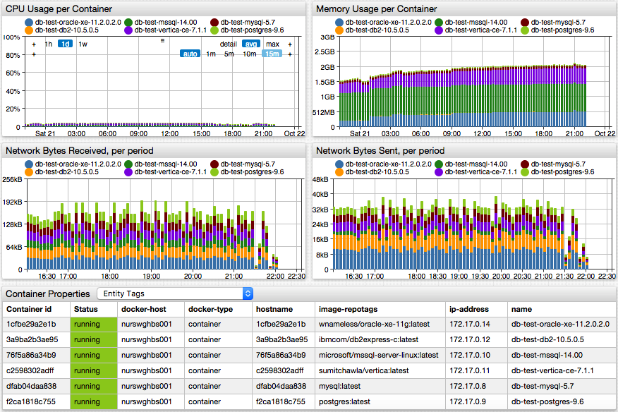
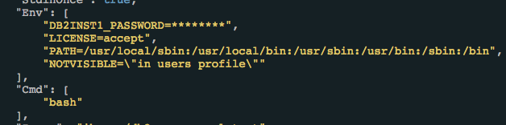

Weekly Change Log: October 9, 2017 - October 15, 2017
==================================================

## ATSD

| Issue| Category    | Type    | Subject              |
|------|-------------|---------|----------------------|
| [4641](#issue-4641) | rule-engine | Feature | Implement `LOOKUP` function to retrieve replacement table items by key. |
| [4636](#issue-4636) | api-rest | Feature | Add support for metric and entity fields to the `expression` parameter in `list` methods. |
| 4630 | rule-engine | Bug | Dictionary service: fix caching for non-lowercased keys. |
| [4627](#issue-4627) | entity_views | Feature | Implement multi-entity portal displayed for entities matched with search. |
| 4623 | storage | Bug | Fix error when region split is initiated in the UI. |
| 4622 | client | Bug | Resolve python installation errors due to broken pandas module. |
| 4617 | storage | Bug | Not all records were deleted for metrics with enabled retention policy. |
| 4608 | client | Bug | Python client upgrade failure. |
| [4605](#issue-4605)  | api-rest | Feature | Add support for `SLOPE` and `INTERCEPT` aggregators in series query. |
| 4598 | security | Feature | Enable auto-login on server restart if 'Remember Me' option is checked on login. |
| 4592 | sql | Bug | Incorrect `datetime OR` complex filter. |
| 4554 | sql | Bug | Change behavior of `datetime !=` operator. |
| 4489 | sql | Bug | Incorrect reference to the `value` column in the `WHERE` clause. |
| [4353](#issue-4353) | sql | Feature | Allow column aliases to be the same as column names. |
| 4103 | sql | Bug | Fix `WITH INTERPOLATE` clause with user-defined timezone. |


## Axibase Collector

| Issue| Category    | Type    | Subject              |
|------|-------------|---------|----------------------|
| 4634 | docker | Bug | Apply limit to `docker.cpu.sum.usage.total.percent` calculation. |
| 4633 | security | Feature | Enable auto-login on server restart if 'Remember Me' option is checked on login. |
| [4625](#issue-4625) | docker | Feature | Read credentials from environment variables. |
| [4616](#issue-4616) | docker | Feature | Mask secrets (passwords) in properties and inspect files. |
| 4582 | docker | Feature | Add shutdown hook in collector to update docker host status on shutdown. |

## Charts

| Issue| Category    | Type    | Subject              |
|------|-------------|---------|----------------------|
| 4626 | time-chart | Bug | Prevent duplicate series from being displayed after incremental data is loaded. |
| 2185 | time-chart | Feature | Speed up rendering of column-stack charts with many series. |

---

### Issue 4641

The [`LOOKUP`](../../rule-engine/functions.md#collection-functions) function returns a matching value for key from the specified replacement table.

```java
lookup(S replacementTable, S key)
```

```java
lookup("cities", "Baltimore")
```

### Issue 4636

The `expression` parameter in [metric](../../api/meta/metric/list.md#expression) and [entity](../../api/meta/entity/list.md#expression) list methods now supports all [metric](../../api/meta/metric/list.md#fields) and [entity](../../api/meta/entity/list.md#fields) fields respectively.

* Entities

```ls
name NOT LIKE 'aws*' AND lower(label) NOT LIKE 'aws*' AND createdDate > '2017-10-01T00:00:00Z'
```

* Metrics

```ls
retentionDays > 0 OR seriesRetentionDays > 0
```

### Issue 4627

The multi-entity portal in entity views displays key metrics for entities matched with a search keyword.





### Issue 4605

The complete list of statistical functions is provided [here](../../api/data/aggregation.md).

```json
[{
  "startDate": "2017-10-21T19:00:00Z",
  "endDate":   "2017-10-21T20:00:00Z",
  "entity": "nurswgvml007",
  "metric": "cpu_busy",
  "aggregate": {
    "types": ["AVG", "SLOPE", "INTERCEPT"],
    "period": {"count": 15, "unit": "MINUTE"}
  }
}]
```

### Issue 4353

```sql
SELECT "export_test"."datetime" AS "datetime",
   "export_test"."entity" AS "entity",
   "export_test"."metric" AS "metric",
   "export_test"."tags" AS "tags",
   "export_test"."text" AS "text",
   "export_test"."time" AS "time",
   "export_test"."value" AS "value"
 FROM "export_test" LIMIT 100
```

### Issue 4625

Add support for the following environment variables:

```ls
  --env COLLECTOR_USER_NAME=cuser
  --env COLLECTOR_USER_PASSWORD=cpassword
  --env ATSD_URL=https://atsd_host:8443
```

### Issue 4616

The values are masked in the following cases:

* If variable name contains 'password' (case insensitive).
* If command arguments contain url with credentials.


