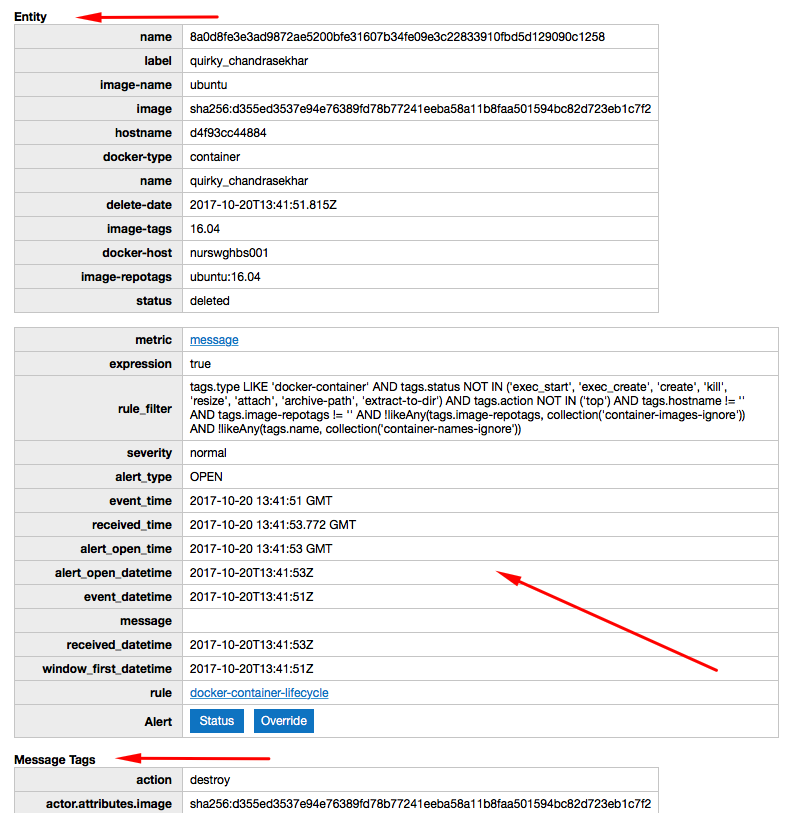

Weekly Change Log: October 16, 2017 - October 22, 2017
==================================================

## ATSD

| Issue| Category    | Type    | Subject              |
|------|-------------|---------|----------------------|
| 4653 | ui | Bug | HTML entities inside editable fields are not escaped. |
| 4648 | sql | Bug | `WHERE tags LIKE` causes an NPE. |
| 4644 | api-rest | Bug | Unicode patterns are not escaped in entity expressions. |
| [4643](#issue-4643) | email | Feature | Split email notification message into multiple tables. |
| [4635](#issue-4635) | api-rest | Feature | Add support for limits in series query with ascending order. |
| 4632 | ui | Bug | Export page - aggregate function drop down broken. |
| 4631 | sql | Bug | Metrics not filtered if specified with `WHERE metric.name = {name}` syntax. |
| 4629 | ui | Bug | Export page fails to display tag values when aggregator is selected. |
| 4615 | rule-engine | Feature | Add support for `metric.label` and other `entity.*` and `metric.*` fields in the [rule engine](../../rule-engine/expression.md). |
| 4614 | rule-engine | Bug | `entity_tags` placeholder doesn't work. |
| [4590](#issue-4590) | client | Feature | Python API client examples. |
| 4555 | sql | Bug | Fix SQL `datetime NOT BETWEEN` condition. |
| [4544](#issue-4544) | sql | Feature | `ESCAPE` keyword to customize `LIKE` escape character. |
| [4404](#issue-4404) | api-rest | Feature | Add API method `/api/v1/search` to search series. |

---

### Issue 4643



### Issue 4635

The `ASC` direction allows retrieving first value for the specified series.

```json
[{
  "startDate": "1970-01-01T00:00:00Z",
  "endDate":   "now",
  "entity": "nurswgvml007",
  "metric": "mpstat.cpu_busy",
  "limit": 10,
  "direction": "ASC"
}]
```

Refer to [series query](../../api/data/series/query.md#control-filter-fields) for additional details.

### Issue 4590

The list of examples is provided [here](https://github.com/axibase/atsd-api-python#examples).

### Issue 4544

Wildcard symbols present in the pattern can be escaped with a backslash `\` which serves as the default escape character.

```sql
-- Default escape character
WHERE tags.file_system LIKE '%a\_b%'
```

The escape character can be customized by adding an ESCAPE clause after the LIKE expression.

```sql
-- Custom escape character
WHERE tags.file_system LIKE '%a~_b%' ESCAPE '~'
```

In the example above, the underscore is evaluated as a regular character (not as a wildcard) because it is preceded by an ~ escape character.

### Issue 4404

Refer to [API documentation](../../api/meta/misc/search.md) for additional details.

```
GET /api/v1/search?query=inflation*&limit=2&metricTags=*&metricFields=units,dataType&entityTags=*&entityFields=timeZone
```

```json
{
  "query": "contents:inflation.cpi.categories*",
  "recordsTotal": 496621,
  "recordsFiltered": 20,
  "time": 136,
  "data": [
    [
      "inflation.cpi.categories.price",
      "CPI - Non-negotiable",
      {
        "units": "million",
        "dataType": "LONG"
      },			
      {
        "pricebase": "Current prices",
        "seasonaladjustment": "Seasonally Adjusted",
        "source": "CBS"
      },
      "fed",
      "U.S. FED",
      {
        "timeZone": "US/Eastern"
      },				
      {
        "source": "FRED"
      },
      {
        "category": "Health"
      },
      1.5
    ],
    [
      "inflation.cpi.categories.price",
      "CPI - Non-negotiable",
      {
        "units": "million",
        "dataType": "LONG"
      },			
      {
        "pricebase": "Current prices",
        "seasonaladjustment": "Seasonally Adjusted",
        "source": "CBS"
      },
      "fed",
      "U.S. FED",
      {
        "timeZone": "US/Eastern"
      },				
      {
        "source": "FRED"
      },
      {
        "category": "Energy"
      },
      1.5
    ]
  ]
}
```
