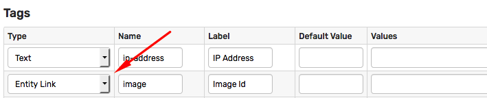
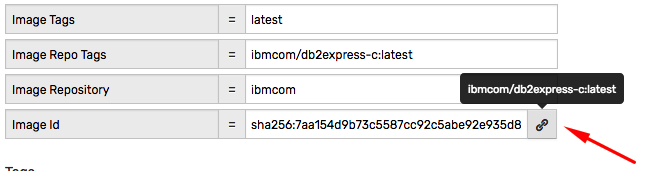
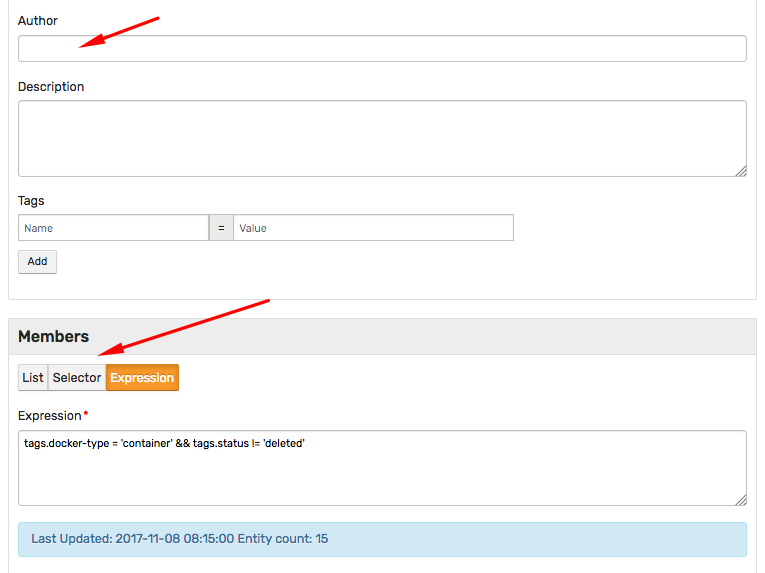
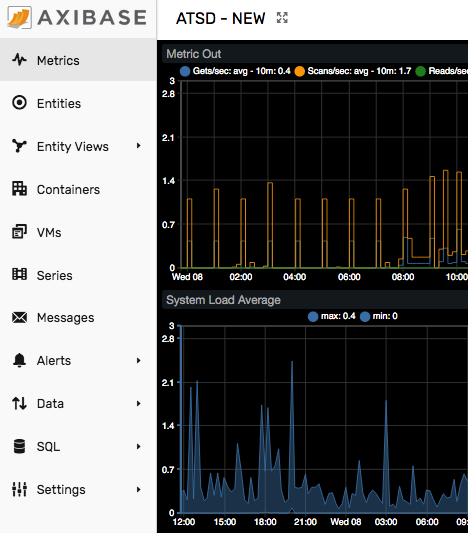

Weekly Change Log: October 29, 2017 - November 06, 2017
==================================================

## ATSD

| Issue| Category    | Type    | Subject              |
|------|-------------|---------|----------------------|
| 4694 | sql | Bug | Storing results into new series fails for new metric/entity if `Check Last Time` is enabled. |
| 4693 | installation | Bug | Fix failing HBase shell tests by increasing a timeout for the last test. |
| 4692 | rule-engine| Bug | Import of an existing rule with the notification breaks the current rule with the same name. |
| [4687](#issue-4687) | api-rest | Feature | Added support for wildcards when requesting metric/entity tags. |
| [4686](#issue-4686) | ui | Feature | Tag templates: added support for 'Entity Link' field type. |
| 4685 | core | Bug | Entity group built with the `hasMetric(name, hours)` function is empty after the scheduled update. |
| [4684](#issue-4684) | ui | Feature | Entity group editor refactored. |
| 4665 | client | Feature | [Python API client](https://github.com/axibase/atsd-api-python) models and utility classes refactored. |
| [4652](#issue-4652) | ui | Feature | New top menu implemented. |

## Axibase Collector

| Issue| Category    | Type    | Subject              |
|------|-------------|---------|----------------------|
| 4673 | docker | Bug | Prevent `docker.sum.diskio.ioservicebytes.write` metric overflow. |

## Charts

| Issue| Category    | Type    | Subject              |
|------|-------------|---------|----------------------|
| 4690 | widgets | Feature | Speed up series filtering in dependent charts. |
| 4678 | api | Feature | Upgrade JavaScript adapter for external charting libraries. |
| 4630 | api | Feature | Implement [`previous()`](https://github.com/axibase/charts/blob/master/syntax/functions.md#previous) function. |

---

### Issue 4687

The `tags` parameter in [Entity Group: Get Entities](../../api/meta/entity-group/get-entities.md#query-parameters), [Entities: List](../../api/meta/entity/list.md#query-parameters), [Metrics: List](../../api/meta/metric/list.md#query-parameters) now accepts wildcards to control the list of tags in the response.

* Retrieve members of the `docker-images` group. Add entity tags that start with `env.` to the response.

```ls
/api/v1/entity-groups/docker-images/entities?tags=env.*
```

### Issue 4686

The 'Entity Link' field resolves the tag value to an entity and displays a link to its editor page. The tooltip contains entity label, if available.





### Issue 4684

* The new `Author` field is automatically pre-filled with the name of the current user in order to coordinate group management in large organizations.

* The member type options were renamed with a new status message.



### Issue 4652

* Navigation flow changed from `top/down` to `left/right`.

* Collapse mode minimizes the amount of space required for top menu links.

* Links are grouped based on the function instead of the user role.

* Portals can be easily accessed from the top toolbar.

* Entity views can be added to the top menu with a custom icon.

 
