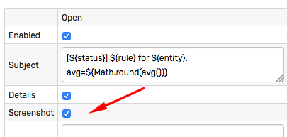
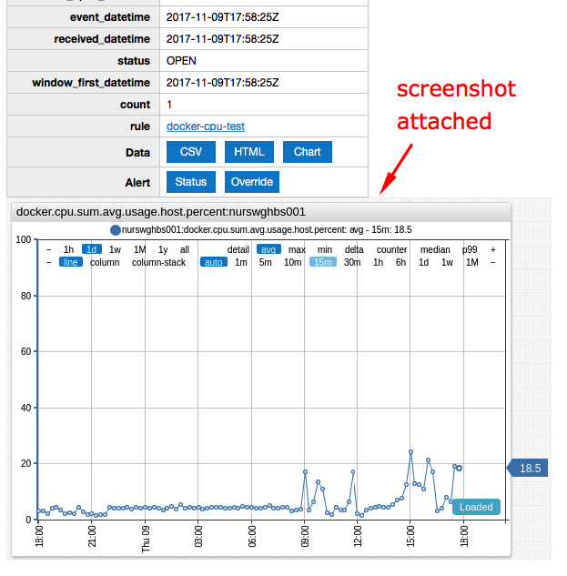
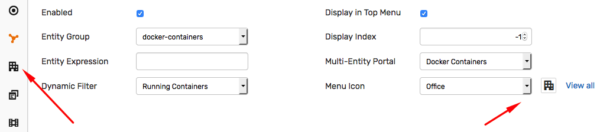
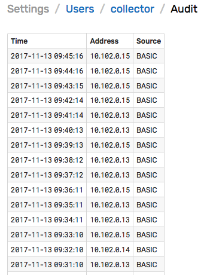

Weekly Change Log: November 07, 2017 - November 13, 2017
==================================================

## ATSD

| Issue| Category    | Type    | Subject              |
|------|-------------|---------|----------------------|
| [4675](#issue-4675) | rule-engine | Feature | Attach charts to email notifications. |
| [4658](#issue-4658) | ui | Feature | Redesign icon selector in the entity view editor. |
| [4600](#issue-4600) | security | Feature | stored login history. |
| [4585](#issue-4585) | ui | Feature | Multiple layout enhancements. |
| [3269](#issue-3269) | sql | Feature | `LIMIT n` optimization for descending date queries. |

## Axibase Collector

| Issue| Category    | Type    | Subject              |
|------|-------------|---------|----------------------|
| 4673 | jdbc | Bug | Fix incorrect ATSD jdbc driver URL. |

## Charts

| Issue| Category    | Type    | Subject              |
|------|-------------|---------|----------------------|
| [4683](#issue-4683) | external | Feature | Update client adapter for external JavaScript libraries. |

---

### Issue 4675

Email notifications can include screenshots of the underlying metric captured using the built-in portal.





### Issue 4658

Entity view can be added to the top menu with a custom icon.



### Issue 4600

Successful user authentication requests are stored in the database and can be reviewed by administrators to identify idle accounts and to measure user activity.




### Issue 4585

* Add new columns to summary tables.
* Add form validations.
* Highlight important settings.
* Add an option to clone user accounts.
* Add toggle between tag labels and names in the entity and metric editors.
* Replace fonts.
* Standardize spacing between buttons.
* Adjust layout on the user's authorization page.

### Issue 3269

Speed up SQL queries that select more than 1 row with descending datetime order.

```sql
SELECT *
  FROM cpu_busy
ORDER BY datetime DESC LIMIT 10
```
