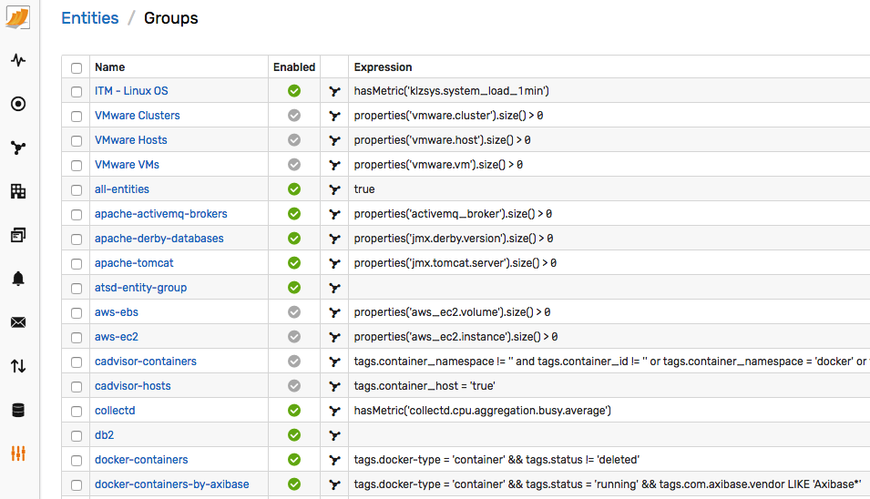

# Entity Groups

## Overview

Entity Groups provide a way to organize similar entities into cohesive collections that can be re-used when managing user permissions, filtering data, calculating aggregations etc.



## Members

An entity group can be composed by manually specifying names of the entities that should be included as members.

It can be also created by specifying a criteria against which all entities that exist in the database will be evaluated. Those entities that match the criteria will be added as members automatically and the group will be continuously updated in the background.

The entity group editor provides the following options for managing entities:

### List

Copy a list of entity names, one per line, into the text area. The names are case-insensitive.

If 'Create Entities' option is checked, new entities will be automatically created when the form is saved. Otherwise, names for which there are no existing entities found, will be ignored.

### Selector

Select one or multiple existing entities in the right pane and click 'Add' to add members.

Select current members in the left pane and click 'Remove' to delete members from the group.

### Expression

Specify a boolean expression to add/remove entities automatically. The expression may refer to entity names, entity tags, properties, and [utility functions](#utility-functions) in order to find matching entities.

> Expression-based groups are continuously updated by the server at a frequency specified with the `entity.group.update.schedule` setting.

Common expressions:

* Entity name contains the specified string

	```java
	name LIKE 'nur*vml*'
	```

* Entity has the specified entity tag

	```java
	tags.docker-type != ''
	```

* Entity has an entity tag equal to the specified value

	```java
	tags.docker-type = 'container'
	```

* Entity has entity tags equal to the specified values

	```java
	tags.docker-type = 'container' && tags.status != 'deleted'
	```

* Entity collects the specified property type

	```java
	properties('oem.oracle_database').size() > 0
	```

* Entity collects the specified metric

	```java
	hasMetric('mpstat.cpu_busy')
	```

* Entity collected the specified metric within N hours

	```java
	hasMetric('mpstat.cpu_busy', 24*7)
	```

* Entity matches the given [property search](../property-search-syntax.md) expression

	```java
	properties('cfg').prog != '' && properties('cfg').prog NOT LIKE 'topas*'
	```

* Entity is a member of another group

		```java
		memberOf('all-linux-servers') && tags.location = 'SVL'
		```


## Utility Functions

```java
Collection<String> list(String value);

Collection<String> list(String value, String delimiter);

boolean likeAll(Object message, Collection<String> values);

boolean likeAny(Object message, Collection<String> values);

boolean matches(String pattern, Collection<String> values);

boolean startsWithAny(Object message, Collection<String> values);

boolean collection_contains(Object value, List list);

boolean collection_intersects(Collection one, Collection two);

String upper(Object value);

String lower(Object value);

Collection<String> collection(String name);

Map<String, String> properties(String type);

boolean hasMetric(String metricName);

boolean hasMetric(String metricName, int hours);

boolean memberOf(String groupName);

boolean memberOf(String group);

boolean memberOf(List<String> groups);

boolean memberOfAll(List<String> groups);

Set<String> property_values(String config);

Set<String> property_values(String entity, String config);

String property(String config);

String property(String entity, String config);
```
