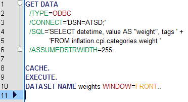
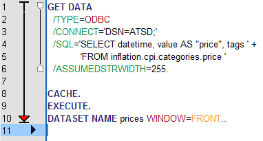
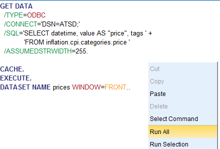
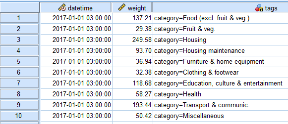

### Configuring the Data Source in IBM SPSS Statistics

* Open the attached scripts:

[weight.sps](resources/weight.sps)

[price.sps](resources/price.sps)
 

* Right click on the script window and select **Run All** to export the data into ATSD.

The scripts will connect to ATSD (`CONNECT='DSN=ATSD'`), execute the query specified in the `SQL` variable and display the dataset.

