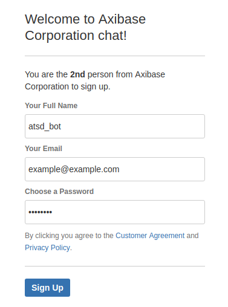

# Hipchat

https://www.atlassian.com/software/hipchat/enterprise/data-center

## Prerequisites

* Install [Hipchat Data Center](hipchat_data_center_install.md)
* Install [WebDriver](README.md#install-web-driver)

> To make requests over HTTPS you need to generate ssl self-signed certificate and copy it to ATSD server truststore

## Create a bot

* Log in to HipChat as admin
* Click **System**

    

* Go to **Team Info**
* Navigate to invite URL, click **Enable**

    

* Copy the link
* Sign out (right upper corner)

    

* Paste link to browser, press **Enter**
* Fill in the fields, click **Sign Up**

    
    
## Generate token

* Click on bot icon (right upper corner)

    
    
* Click **Profile**
* Go to **API tokens**

> Make sure you are using API v2: there should be no warnings

* Select **Send Message** from **Scopes** field
* Fill in the **Label** filed
* Click **Create**

    

* Copy the token
* Log out

## Create a room

* Log in to HipChat as admin
* Click **Start chatting**
* Click **Create a room**
    
    
    
* Fill in the fields, check (enable) **Private room**, click **Create room**

    
    
* Enter members to receive notifications from ATSD (you can do it later), enter bot user, click **Invite people**

    

* Get room id:
    * click on team name
    
    
    
    * click on recently created room
    
    
    
    * look at URL, last number is the room id
    
     
    

