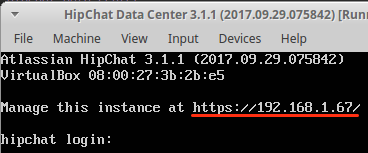
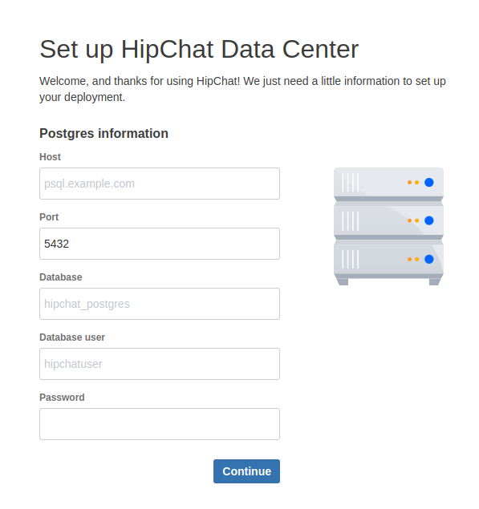
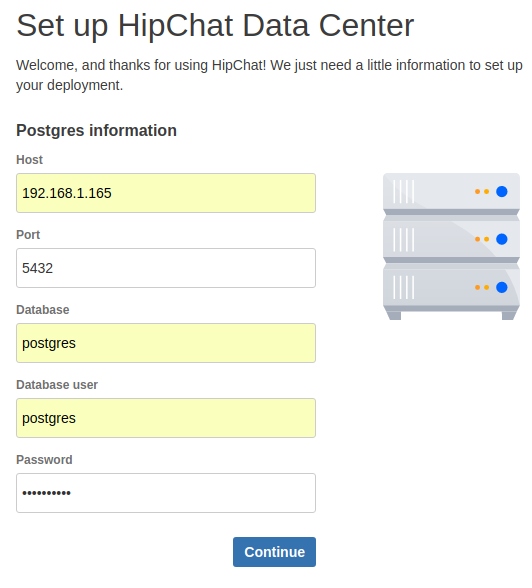
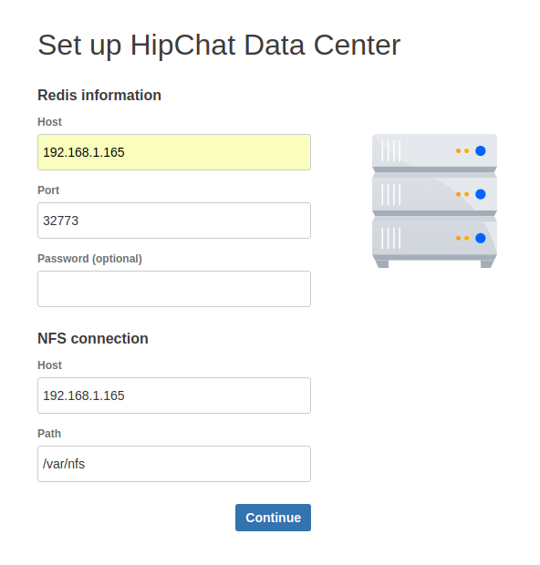
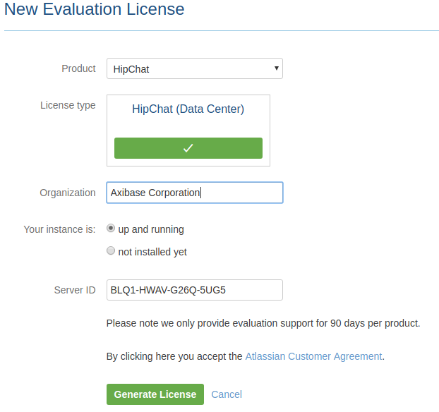
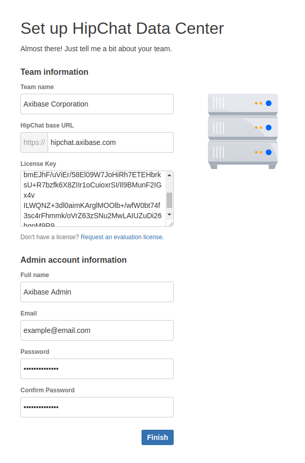
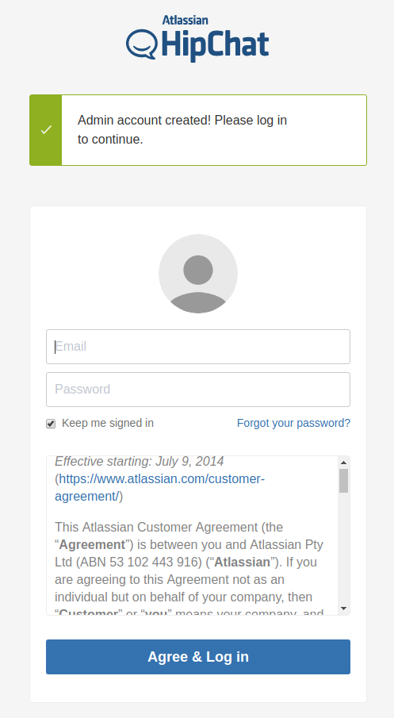

# Hipchat Data Center Installation

* Download OVA 3.1.1 https://s3.amazonaws.com/hipchat-server-stable/dc/HipChat.ova
* Run VM

    
    
  To manage instance use following credentials:
                     
  ```bash
  Login: admin
  Password: hipchat
  ```
    
* Navigate to https://HIPCHAT_HOST

    

* Fill in the fields, click **Continue**

    

* Fill in the fields, click **Continue**

    

* Click **Request an evaluation license.**

    
    
* Click **Generate License** and cope the key to the **License Key** field
* Fill in the other fields and click **Finish**

    
    
    If setup is successful you will see following:

    
    
See more info:

* [Deploy HipChat Data Center](https://confluence.atlassian.com/hipchatdc3/deploy-hipchat-data-center-907350423.html)

* [Hardware requirements for a small-scale HipChat Data Center deployment](https://confluence.atlassian.com/hipchatdc3/set-up-a-small-scale-hipchat-data-center-cluster-939689319.html#Setupasmall-scaleHipchatDataCentercluster-Hardwarerequirementsforasmall-scaleHipChatDataCenterdeployment)

