# Slack

https://slack.com/

## Prerequisites

Install a [Web Driver binary](README.md#install-web-driver)

## Create workspace and channel

* Go to https://slack.com/create and follow the prompts to create a new workspace
* Create a new channel:

    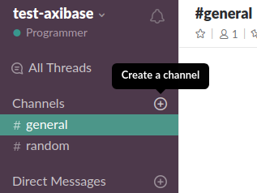
    
    * check (enable) **Private** to restrict access
    * invite members to receive notifications from ATSD (you can do it later)
      
    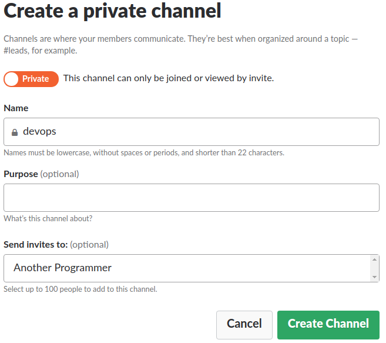   
    
    * click **Create Channel**

## Add bot integration 

* Go to https://my.slack.com/services/new/bot 
* Check Workspace 

    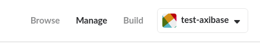  

* Fill in the username field , click **Add bot integration**

    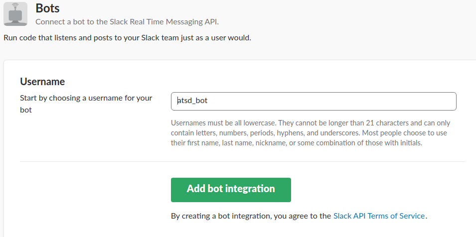  

* Review setup instructions
* Copy API Token, click **Save Integration**

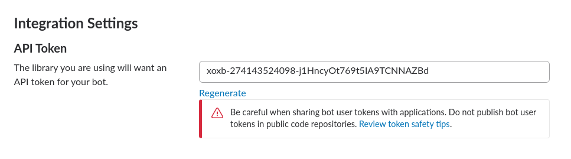 

* Invite bot to the channel: 
    * go back to https://my.slack.com/
    * click **Invite others to this private channel**
    
    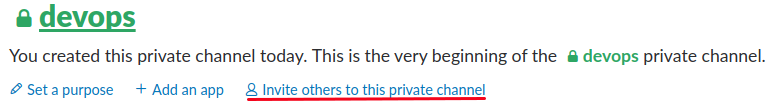 
    
    * choose any option for the channel
    
    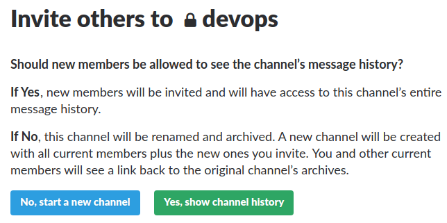 
    
    * enter bot name to the search field
    
    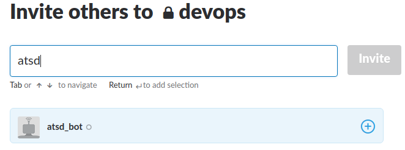 
    
    * click **Invite**

    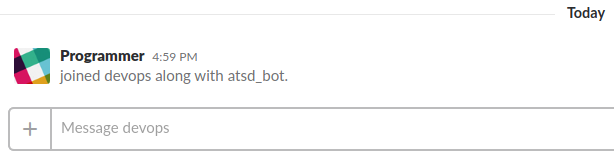 
 
## Configure Web Notifications

* Log in to ATSD web UI
* Go to **Admin > Web Notifications > Slack**
* Specify `Auth Token` and `Channels`
* Fill in the text field 

    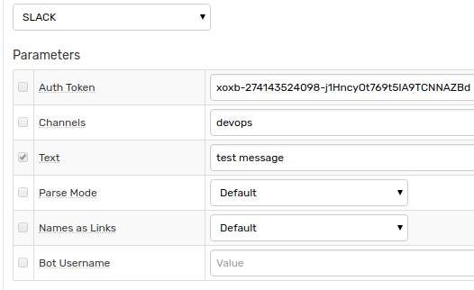

* Click **Test**

   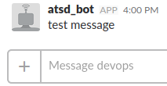
   
* Select **Test Portal**
 
      
   
* Click **Send Screenshot**

   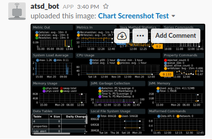 
   
The following parameters are supported:

|**Parameter**|**Description**|
|---|---|
|Auth Token|Authentication token bearing required scopes.|
|Channels|Comma-separated list of channels, private groups, or IM channels to send message to. Each entry can be an encoded ID, or a name.|
|Text|Text of the message to be sent. This field is usually required, unless you're providing only alert details instead.|
|Parse Mode|Change how messages are treated. See [Basic message formatting](https://api.slack.com/docs/message-formatting)|
|Names as Links|Find and link channel names and usernames.|

If tests are ok, check **Enable**, click **Save**   

## Configure Rule

* Download the file [rules.xml](resources/rules.xml)
* Open **Alerts > Rules > Import** 
* Check (enable) **Auto-enable New Rules**, click on **Choose File**, select the downloaded XML file, click **Import**.
* Open the imported rule, go to the **Web Notifications** tab, select Slack from **Notification** drop-down
* Fill text field with `Alert open: ${entity}, ${metric}.`
* Save the rule by clicking on the **Save** button

## Test

* Go to **Data > Data Entry** and run the following command:

```ls
series e:server001 m:test_metric=8
```

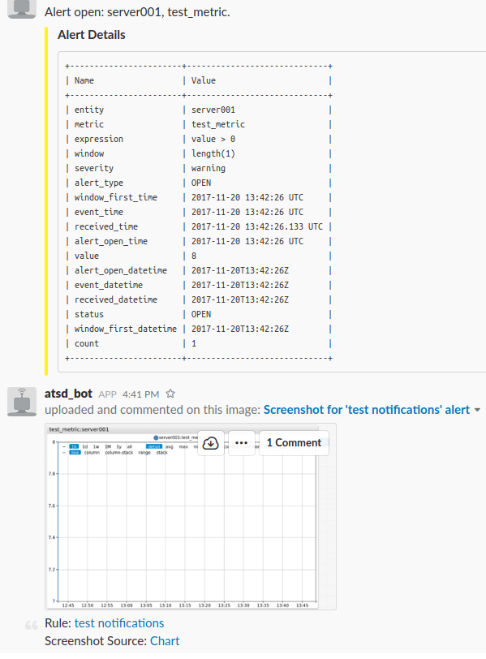 
