# Telegram

https://telegram.org/

## Prerequisites

Install [WebDriver](README.md#instal-web-driver)

## Create bot

* Open a conversation with the [BotFather](https://telegram.me/botfather)

    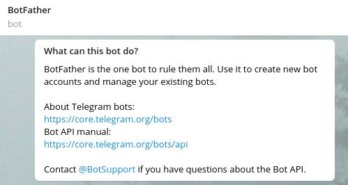

* Send command `/newbot` and follow the prompts to create bot user and obtain the token

> Note the next step is required only if you want send notifications to group

* Enable groups for bot:
  * send `/mybots`to the BotFather
  * select recently created bot > **Bot Settings > Allow Groups? > Turn groups on** if required

## Create group or channel

### Create Group

* Go to profile settings > **New Group**

   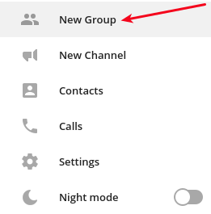

* Enter group name > **Next**
* Add created bot, for example `@atsd_bot`

   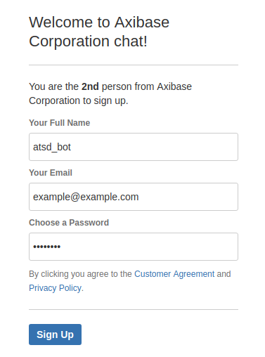

* Add other members to receive notifications from ATSD > **Create**
* Get the chat id:
  * log in [Telegram Web](https://web.telegram.org)
  * click on group and look at URL: /#/im?p=g**306974066**
  
   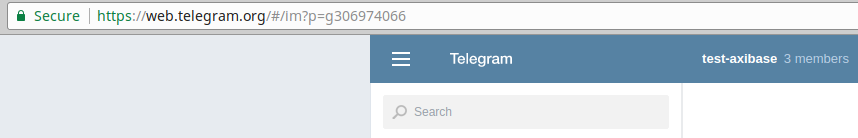
   
 * copy numbers and add prefix `-`, so the chat id will be like `-306974066`

### Create Channel

* Go to profile settings > **New Channel**

   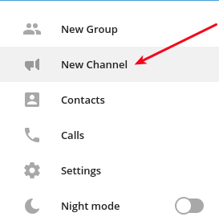

* Enter channel name > **Create**
* Check (enable) **Private channel > Save**

   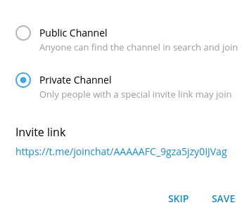

* Add members to receive notifications from ATSD (you can do it later) > **Invite**
* Click on **Channel Settings > View channel info**

   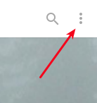       

   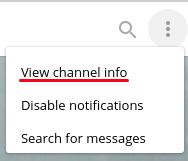

* **N administrators > Add administrator** > enter bot name to the search field, for example `@atsd_bot` 

   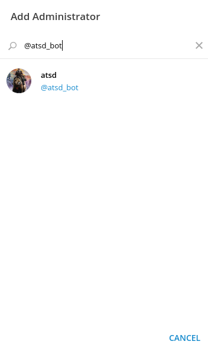

   Click on bot > **Ok**

   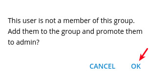
   
   Review settings and click **Save > Close**

   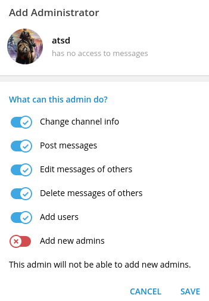

* Get the chat id:
  * log in [Telegram Web](https://web.telegram.org)
  * click on channel and look at URL: /#/im?p=c**1354757644**_16698643680908793939
  
   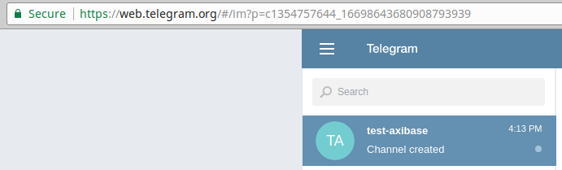
  
  * copy numbers before underscore and add prefix `-100`, so the chat id will be like `-1001354757644`

## Configure Web Notifications

* Log in ATSD web UI
* Go to **Admin > Web Notifications > Telegram**
* Specify `bot_id` with `BOT_TOKEN` and `chat_id` with chat id of group or channel
* Fill the text field 
   
   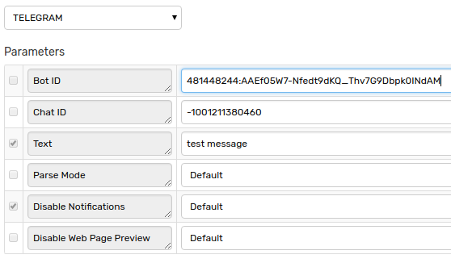

* Click **Test**

   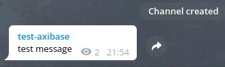
   
* Select **Test Portal**
 
   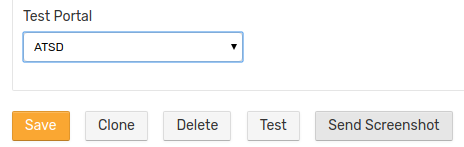   
   
* Click **Send Screenshot**

   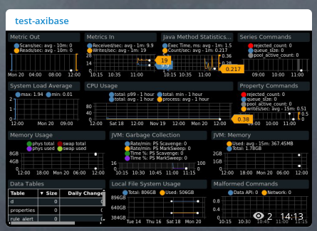 
   
In addition it's possible to specify other parameters:

|**Field**|**Description**|
|---|---|
|Bot ID|Each bot is given a unique authentication token when it is created.|
|Chat ID|Unique identifier for the target chat or the target channel.|
|Text|Text of the message to be sent.|
|Parse Mode|Send [Markdown](https://core.telegram.org/bots/api#markdown-style) or [HTML](https://core.telegram.org/bots/api#html-style) if you want show bold, italic, fixed-width text or inline URLs in your message.|
|Disable Notifications|Sends the message silently. Users will receive a notification with no sound.|
|Disable Web Page Preview|Disables link previews for links in this message.|

If tests are ok, check **Enable**, click **Save**

## Configure Rule

* Download file [rules.xml](resources/rules.xml)
* **Alerts > Rules > Import** 
* **Choose File** > Check (enable) **Auto-enable New Rules > Import**
* Open imported rule > **Web Notifications** > Select Telegram from **Notification** drop-down
* Fill text field with `Alert open: ${entity}, ${metric}.` > **Save**

## Test

* **Data > Data Entry** > run the following command

```bash
series e:server001 m:test_metric=8
```
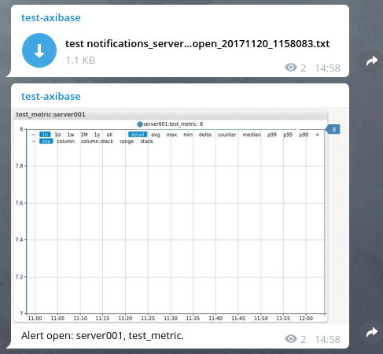 

Content of _test notifications_server001_open_20171120_1158083.txt_:

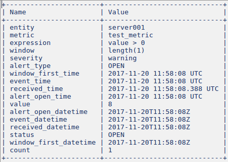

## Notifications examples

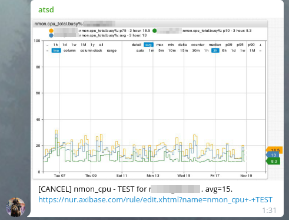

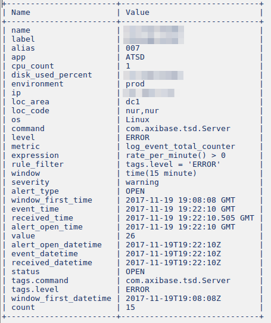

